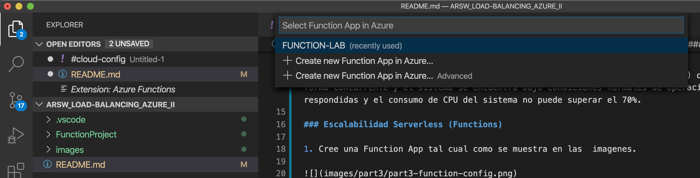

### Escuela Colombiana de Ingeniería
### Arquitecturas de Software - ARSW

## Escalamiento en Azure con Maquinas Virtuales, Sacale Sets y Service Plans

### Dependencias
* Cree una cuenta gratuita dentro de Azure. Para hacerlo puede guiarse de esta [documentación](https://azure.microsoft.com/en-us/free/search/?&ef_id=Cj0KCQiA2ITuBRDkARIsAMK9Q7MuvuTqIfK15LWfaM7bLL_QsBbC5XhJJezUbcfx-qAnfPjH568chTMaAkAsEALw_wcB:G:s&OCID=AID2000068_SEM_alOkB9ZE&MarinID=alOkB9ZE_368060503322_%2Bazure_b_c__79187603991_kwd-23159435208&lnkd=Google_Azure_Brand&dclid=CjgKEAiA2ITuBRDchty8lqPlzS4SJAC3x4k1mAxU7XNhWdOSESfffUnMNjLWcAIuikQnj3C4U8xRG_D_BwE). Al hacerlo usted contará con $200 USD para gastar durante 1 mes.

### Parte 0 - Entendiendo el escenario de calidad

Adjunto a este laboratorio usted podrá encontrar una aplicación totalmente desarrollada que tiene como objetivo calcular el enésimo valor de la secuencia de Fibonnaci.

**Escalabilidad**
Cuando un conjunto de usuarios consulta un enésimo número (superior a 1000000) de la secuencia de Fibonacci de forma concurrente y el sistema se encuentra bajo condiciones normales de operación, todas las peticiones deben ser respondidas y el consumo de CPU del sistema no puede superar el 70%.

### Escalabilidad Serverless (Functions)

1. Cree una Function App tal cual como se muestra en las  imagenes.

2. Instale la extensión de **Azure Functions** para Visual Studio Code.

3. Despliegue la Function de Fibonacci a Azure usando Visual Studio Code. La primera vez que lo haga se le va a pedir autenticarse, siga las instrucciones.

4. Dirijase al portal de Azure y pruebe la function.

5. Modifique la coleción de POSTMAN con NEWMAN de tal forma que pueda enviar 10 peticiones concurrentes. Verifique los resultados y presente un informe.

6. Cree una nueva Function que resuleva el problema de Fibonacci pero esta vez utilice un enfoque recursivo con memoization. Pruebe la función varias veces, después no haga nada por al menos 5 minutos. Pruebe la función de nuevo con los valores anteriores. ¿Cuál es el comportamiento?.

**Preguntas**

* ¿Qué es un Azure Function?

Azure Functions es un servicio en la nube que proporciona toda la infraestructura y recursos que se actualizan continuamente y que se necesitan para ejecutar todo tipo de aplicaciones. Permite que el usuario se concentre más en los fragmentos de código que más le importan y Functions se encarga del resto. Functions proporciona procesamiento sin servidor para Azure. Sirve para responder a cambios en la base de datos, procesar transmisiones de IoT, administrar colas de mensajes, etc.

* ¿Qué es serverless?

Serverless o "Sin servidor", es un modelo de ejecución en el que el proveedor en la nube (AWS, Azure o Google Cloud) es responsable de ejecutar un fragmento de código mediante la asignación dinámica de los recursos. Y cobrando solo por la cantidad de recursos utilizados para ejecutar el código. El código, generalmente, se ejecuta dentro de contenedores sin estado que pueden ser activados por una variedad de eventos que incluyen solicitudes HTTP, eventos de base de datos, servicios de colas, alertas de monitoreo, carga de archivos, eventos programados, etc. El código que se envía a el proveedor en la nube para la ejecución es generalmente en forma de una función. Por lo tanto, serverless a veces se denomina “Funciones como servicio” o “FaaS”. 

* ¿Qué es el runtime y que implica seleccionarlo al momento de crear el Function App?

El runtime es el intervalo de tiempo de ejecución en el cual un programa se ejecuta. En azure esta relacionado con la versión de .NET, Nodejs (desde la versión 3), Python o Java en la que se basa el tiempo de ejecuión. En este caso utilizamos el plan Consumption y la versión de runtime 12, lo cual implica que el tiempo de timeout será de 5 minutos y además nuestra memoria se limpiará en este intervalo de tiempo.

* ¿Por qué es necesario crear un Storage Account de la mano de un Function App?

Debido a que Azure Functions se basa en Azure Storage para operaciones de almacenamiento y administración como son Manejo de triggers y logs. Azure Storage account nos proporciona un espacio de nombres unico para el almacenamiento.

* ¿Cuáles son los tipos de planes para un Function App?, ¿En qué se diferencian?, mencione ventajas y desventajas de cada uno de ellos.

**Plan de consumo:** Cuando se usa el plan de consumo, las instancias del host de Azure Functions se agregan y quitan de forma dinámica según el número de eventos entrantes. Este plan sin servidor se escala automáticamente y solo se le cobra por los recursos de proceso cuando se ejecutan las funciones. En un plan de consumo, se agota el tiempo de espera de una ejecución de función tras un período de tiempo configurable. Ventajas:
1. Solo se paga por los recursos utilizados.
2. Escala horizontalmente de manera automatica, incluso durante periodos de gran carga.

**Plan premium:** Cuando se usa el plan Prémium, las instancias del host de Azure Functions se agregan y quitan según el número de eventos entrantes al igual que con el plan de consumo. Ventajas:
1. Instancias permanentemente semiactivas para evitar cualquier inicio en frío
2. Conectividad de red virtual
3. Duración de la ejecución ilimitada (60 minutos garantizados)
4. Tamaños de la instancia Prémium (un núcleo, dos núcleos y cuatro instancias de núcleo)
5. Precios más previsibles
6. Asignación de aplicaciones de alta densidad para planes con varias aplicaciones de funciones

**Plan de servicio de aplicaciones:** Las aplicaciones de funciones también pueden ejecutarse en las mismas máquinas virtuales dedicadas que otras aplicaciones de App Service (SKU básica, estándar, prémium y aislada), con este plan, para escalar horizontalmente de forma manual, se puede agregar más instancias de máquina virtual. También puede habilitar el escalado automático, aunque este sea más lento que la escala elástica del plan Premium. Ventajas:
1. Tiene máquinas virtuales infrautilizadas que ya ejecutan otras instancias de App Service.
2. Quiere proporcionar una imagen personalizada en la que ejecutar sus funciones.

**Diferencias:** La diferencia entre cada uno de estos planes es que el plan de consumo varía la cantidad de recursos ofrecidos según la necesidad del usuario, mientras que el plan premium permite un mayor desempeño para las funciones y mayores capacidades de procesamiento. Y finalmente el plan de servicio de aplicaciones proporciona herramientas para aquellos que necesitan hacer calculos con una mayor carga.

* ¿Por qué la memoization falla o no funciona de forma correcta?

* ¿Cómo funciona el sistema de facturación de las Function App?

Para todos los tipos se mira según el numero de ejecuciones realizadas por mes, además hay otros factores que influyen en la facturación dependiendo del plan, por ejemplo el consumo de recursos en donde se factura según el uso de estos, la duración de uso de VCPU y la duración de uso de la memoria.

